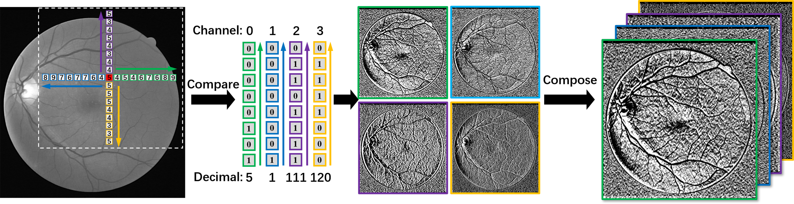
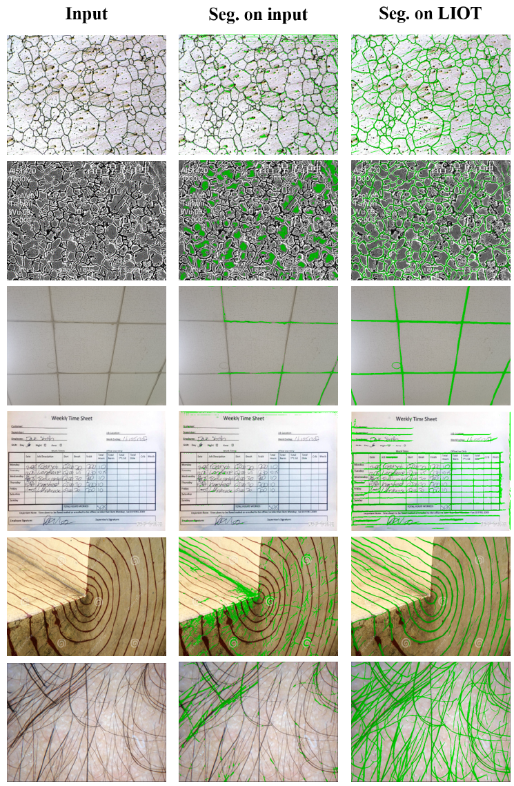

# Local Intensity Order Transformation for Robust Curvilinear Object Segmentation

## Introduction
Pytorch implementation of the paper ["Local Intensity Order Transformation for Robust Curvilinear Object Segmentation", Accepted by IEEE TIP](https://arxiv.org/abs/2202.12587). In this paper, we aim to improve curvilinear object segmentation generalizability by introducing a novel local intensity order transformation (LIOT).

## Citation
Please cite the related works in your publications if it helps your research:
comming soon...


```
@ARTICLE{Shi2022LIOT,
  author={Shi, Tianyi and Boutry, Nicolas and Xu, Yongchao and Géraud, Thierry},
  journal={IEEE Transactions on Image Processing}, 
  title={Local Intensity Order Transformation for Robust Curvilinear Object Segmentation}, 
  year={2022},
  volume={},
  number={},
  pages={1-1},
  doi={10.1109/TIP.2022.3155954}}
```

## Prerequisities
* Datasets: [[DRIVE]](https://drive.grand-challenge.org/), [[STARE]](https://cecas.clemson.edu/~ahoover/stare/), [[CHASEDB1]](https://blogs.kingston.ac.uk/retinal/chasedb1/), [[CrackTree]](https://drive.google.com/drive/folders/1y9SxmmFVh0xdQR-wdchUmnScuWMJ5_O-)
* opencv >= 4.5.2
* h5py >= 3.2.1
* scikit-learn >= 0.23.2
* pytorch >= 1.7.0

## Usage

#### 1.Convert RGB image to LIOT image

```bash
# adjust data dir in LIOT.py (for different dataset)
python src/LIOT.py #LIOT.py is an example python script.

```
#### 2. Data preparation

```bash

# prepare dataset hdf5
python prepare_datasets.py

```  
#### 3. Training scripts

```bash

CUDA_VISIBLE_DEVICES=0 python src/curvilinearNN_training_topo.py

```

#### 4. Evaluation scripts

```bash

CUDA_VISIBLE_DEVICES=0 python src/curvilinearNN_predict_thresh.py

```
#### 5. Trained models
Trained models can be downloaded from here. [[Google Drive](https://drive.google.com/file/d/1wtATuEFbZPZ06k_C_T5gV59u-_eaH3cJ/view?usp=sharing)] [[Baidu Drive](https://pan.baidu.com/s/1_r3CFhW-qjJZD2nE5iIBzw) (download code: urc2) ].   
Put the weights in the "DRIVE-LIOT_Iternet_weights/" directory.  

## LIOT Algorithm


## Example Results
1. Some segmentation results under cross-dataset validation. Green pixels: TPs; Red pixels: FNs; Blue pixels: FPs. Some FPs achieved by LIOT can find evidence in the original image, which might be TPs ignored in the manual annotation.

   
2. Visualization of the segmentation results under crossdataset validation between CrackTree and retinal dataset.

   
3. Visualization of the segmentation results under crossdataset validation between retinal and CrackTree datasets.


4. Some segmentation results on different types of curvilinear images using the model trained on DRIVE dataset. From left to right: input image, segmentation on the original image using the baseline model, segmentation result by LIOT.

## Quantitative Reuslts
Quantitative comparison of LIOT and some other methods under cross-dataset evaluation on retinal images.


## Future Work

More convenient LIOT will be continuously updated.

## Contact

Thanks for your attention!
If you have any suggestion or question, you can leave a message here or contact us directly:
- shitianyihust@hust.edu.cn
- yongchaoxu@hust.edu.cn
